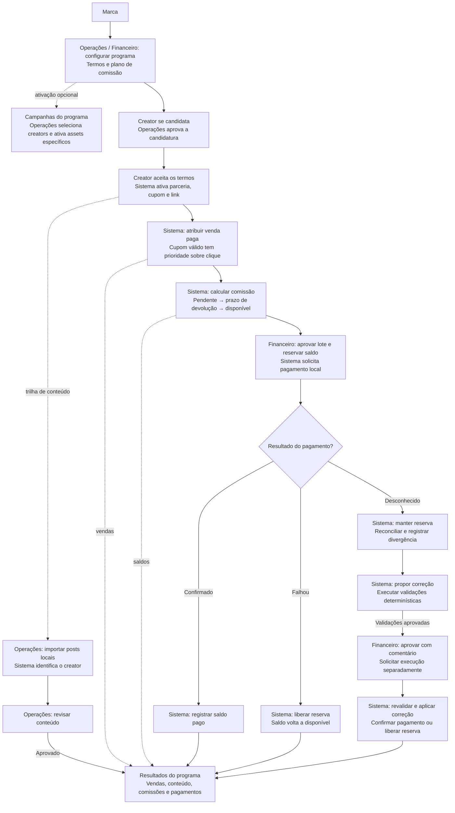
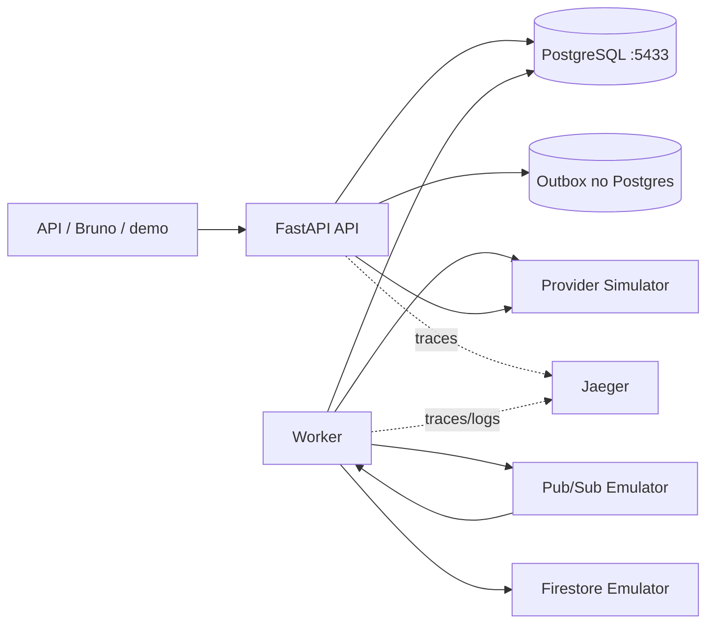

# CreatorOps Agentic Platform

Backend local para estudar, implementar e defender regras reais de uma operação de
influência e afiliados. O projeto tem identidade própria e foi inspirado no domínio da
vaga — não replica produto, marca ou interface de outra empresa.

O caminho demonstrado é:

```text
programa → creator → cupom/link → venda → comissão → payout
        → inconsistência → proposta determinística → gates → aprovação → reconciliação
```

## O que existe no MVP

- FastAPI, Pydantic v2 e SQLAlchemy 2 assíncrono.
- PostgreSQL 16 transacional com Alembic e ledger append-only.
- Autenticação JWT, RBAC (`owner`, `ops`, `finance`, `creator`) e isolamento por marca.
- Programas, campanhas, termos versionados, candidaturas, convites e ativação de creator.
- Seleção de participantes por campanha, assets específicos e plano de comissão opcional.
- Cupons e links, clique rastreável e atribuição com precedência de cupom.
- Webhooks HMAC idempotentes, inclusive duplicidade concorrente e eventos fora de ordem.
- Comissão por plano imutável, faixa de GMV, bônus, janela de devolução e liquidação.
- Firestore Emulator para posts brutos e Pub/Sub Emulator com outbox/inbox. Reimportar posts
  revisados preserva a decisão humana e o revisor.
- Payout local com `pending`, `confirmed`, `failed` e `unknown`.
- Provedor financeiro FastAPI deliberadamente instável e idempotente.
- Reconciliação, finding imutável, proposta determinística, gates e aprovação humana.
- Logs JSON, correlation ID, métricas Prometheus e traces no Jaeger.
- Contratos tipados de leitura, paginação, relatórios de programa/campanha/creator e auditoria.
- Cenário ponta a ponta executável e coleção Bruno encadeada.

Nenhuma conta cloud, LLM, rede social ou transferência real é usada.

Todos os nomes, identidades, pedidos, posts e pagamentos da demonstração são sintéticos.

## Onde está o agentic?

O nome “Agentic Platform” descreve o formato do pipeline de decisão, não uma dependência de
modelo de linguagem. Quando uma divergência financeira aparece, o sistema registra as
evidências, gera uma proposta estruturada, executa gates determinísticos, exige aprovação
humana, revalida o estado e só então aplica a correção com auditoria e lançamentos
append-only no ledger.

O MVP usa um gerador determinístico local e não chama uma LLM. Futuramente, uma LLM poderá
ser conectada ao ponto de geração da proposta para sugerir explicações ou ações, mas nenhuma
garantia de idempotência, autorização, consistência financeira ou segurança depende dela.

## Fluxo de negócio

A marca organiza o programa; Operações ativa creators; o sistema atribui vendas e calcula
comissões; Financeiro aprova os pagamentos. As campanhas são ativações opcionais do programa.



O conteúdo social segue uma trilha própria: sua aprovação alimenta os relatórios, mas não
condiciona a comissão de uma venda. Na reconciliação, a aprovação humana e a execução são
ações separadas; propostas bloqueadas ou desatualizadas não aplicam correções.

Veja os [seis fluxos detalhados das regras de negócio](docs/domain-rules.md), com decisões,
responsáveis, estados e tratamento das exceções.

## Arquitetura local



Postgres é a fonte de verdade para dinheiro e decisões. Firestore guarda o documento social
bruto; Pub/Sub apenas transporta mensagens. O worker pode receber a mesma mensagem mais de
uma vez, mas a inbox e as chaves idempotentes impedem efeitos duplicados.

## Portas

| Serviço | URL/porta no Mac |
|---|---|
| API e Swagger | `http://localhost:8000/docs` |
| PostgreSQL do projeto | `localhost:5433` |
| Firestore Emulator | `localhost:8080` |
| Pub/Sub Emulator | `localhost:8085` |
| Provider Simulator | `http://localhost:8090/docs` |
| Jaeger | `http://localhost:16686` |

O PostgreSQL do Docker usa `5432` internamente e é publicado como `5433`. Portanto, o seu
PostgreSQL já existente em `localhost:5432` não é acessado pelo CreatorOps.

## Começar

Pré-requisitos: Docker com Compose e `uv`. O lockfile também fixa a distribuição Python
3.12 usada no ambiente de desenvolvimento.

```bash
cp .env.example .env
make up
make seed
```

Espere `/health/ready` responder `200`, abra o Swagger e autentique com uma das contas:

| Papel | E-mail | Senha | Marca |
|---|---|---|---|
| owner | `owner@creatorops.dev` | `CreatorOps123!` | `creatorops-demo` |
| ops | `ops@creatorops.dev` | `CreatorOps123!` | `creatorops-demo` |
| finance | `finance@creatorops.dev` | `CreatorOps123!` | `creatorops-demo` |

São credenciais locais e deliberadamente públicas; nunca devem ser reutilizadas fora deste
ambiente.

## Demonstração completa

Com a stack em execução:

```bash
make demo
```

Esse único comando prepara dados exclusivos e percorre a jornada inteira. Ele cria dois
creators e uma campanha com plano próprio para provar um conflito real: o clique pertence
ao creator B, mas o cupom de campanha válido do creator A vence. Também reenvia o mesmo
webhook para provar idempotência, importa e reimporta conteúdo preservando a revisão,
liquida a comissão com relógio avançado, provoca timeout depois do pagamento e fecha a
divergência somente após gates e aprovação humana.

A mesma jornada pode ser executada request por request no Bruno. Abra a pasta `bruno/`,
selecione o ambiente `local` e rode a coleção inteira. Ela cobre os endpoints públicos,
salva automaticamente tokens e IDs entre as etapas e inclui checks negativos de HMAC, RBAC,
isolamento e idempotência. O guia está em [bruno/README.md](bruno/README.md).

O JSON final deve mostrar, entre outros campos:

```json
{
  "coupon_won_conflict": true,
  "webhook_replay_idempotent": true,
  "payout_before_reconciliation": "unknown",
  "finding_type": "provider_confirmed_internal_unknown",
  "gate_result": "passed",
  "proposal_state": "executed",
  "content_review_preserved_after_reimport": true
}
```

## Comandos úteis

```bash
make logs       # acompanha API e workers
make migrate    # aplica somente migrations Alembic
make seed       # cria a marca e usuários locais de forma idempotente
make test       # testes contra Postgres dedicado na porta 5434
make lint       # Ruff
make typecheck  # mypy estrito
make verify     # lint + tipos + testes + alembic check
make down       # para a stack sem apagar volumes
make reset      # apaga apenas os volumes Docker deste Compose
```

`make reset` remove o banco e o SQLite do simulador associados ao projeto Docker
`creatorops`; não toca no PostgreSQL do host.

## Regras que valem mais que a tecnologia

1. Cupom ativo sempre vence link conflitante; sem cupom vale clique válido.
2. Atribuição confirmada não é silenciosamente reescrita.
3. Mesmo `event_id` + mesmo payload é replay; payload diferente resulta em `409`.
4. Eventos atrasados não fazem um pedido regredir.
5. Plano de comissão é selecionado pelo instante da venda e sua versão fica gravada.
6. Dinheiro usa `Decimal`/`NUMERIC`, nunca `float`.
7. Ledger não sofre `UPDATE` ou `DELETE`; correções são novos lançamentos.
8. Timeout financeiro mantém a reserva e preserva a mesma chave idempotente.
9. Proposta agêntica não altera dados, aprovação não executa, execução revalida tudo.
10. Toda consulta operacional recebe o escopo da marca do principal autenticado.

Detalhes estão em [docs/domain-rules.md](docs/domain-rules.md) e a decomposição técnica em
[docs/architecture.md](docs/architecture.md).

O contrato para a próxima fase está em [docs/frontend-handoff.md](docs/frontend-handoff.md).

## Estrutura

```text
src/creatorops/
  core/            configuração, banco, auth, erros e observabilidade
  models/          modelo relacional por limite de domínio
  services/        regras e transações
  routers/         contratos HTTP finos
  worker.py        outbox, consumers e liquidação
provider_sim/      provedor financeiro local e idempotente
migrations/        única forma de criar/evoluir o schema
fixtures/          posts sociais simulados
bruno/             coleção HTTP local
tests/             unidade, integração, concorrência e jornada financeira
docs/              arquitetura e regras de negócio publicáveis
```

## Próxima fase

O frontend será separado, usando React puro, TanStack Query/Router, Tailwind e shadcn/ui.
Não há frontend nem preparação de deploy neste repositório por decisão de escopo.
