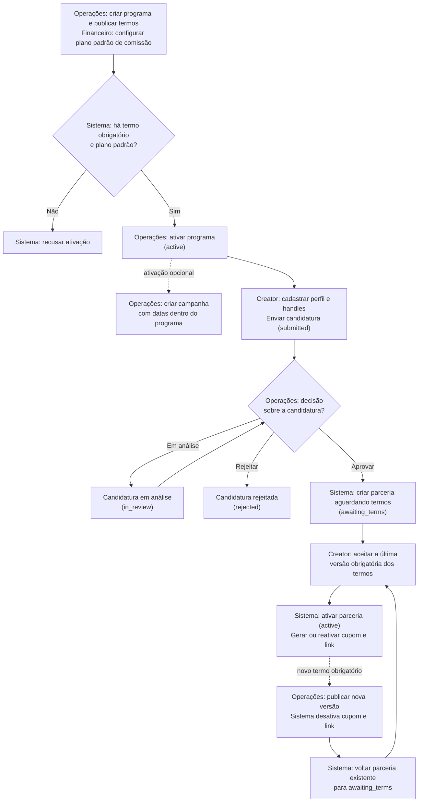
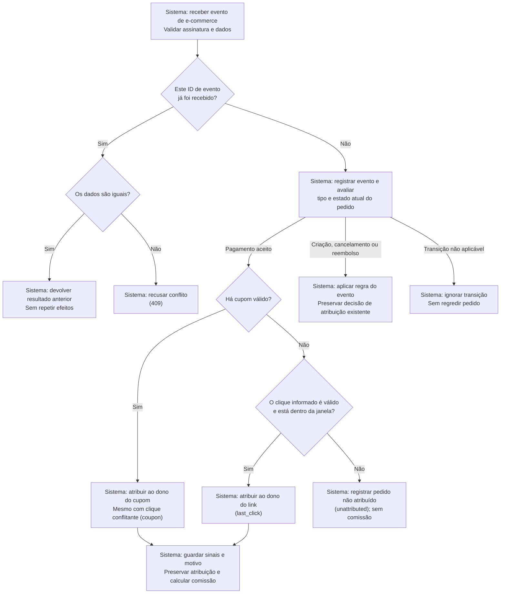
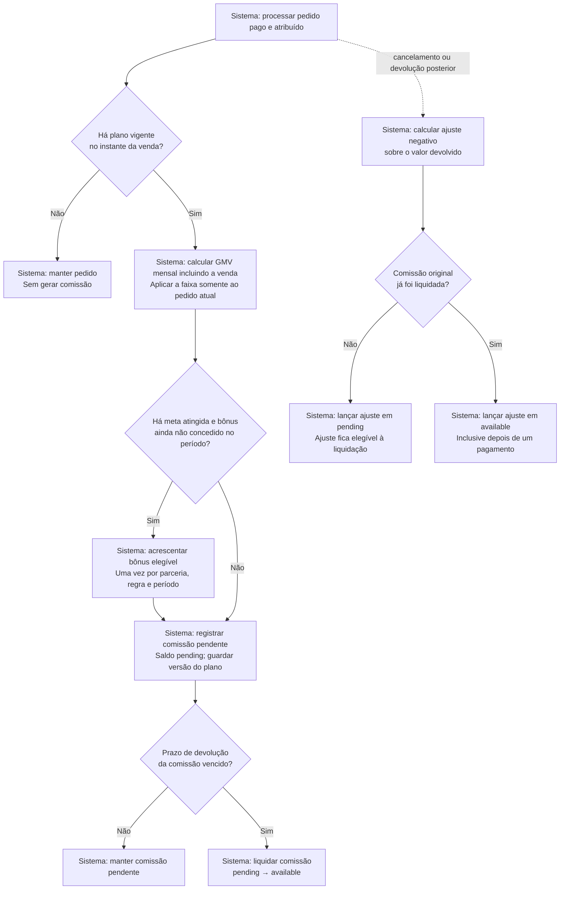
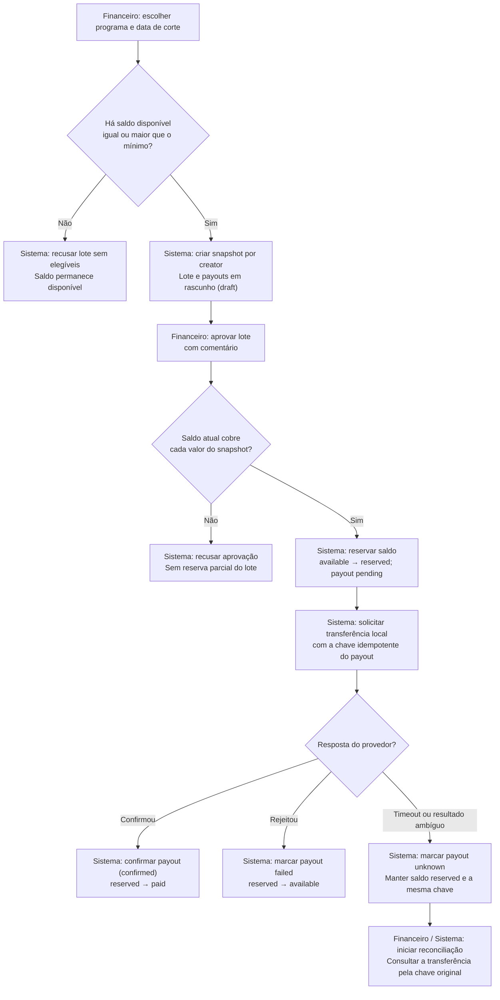
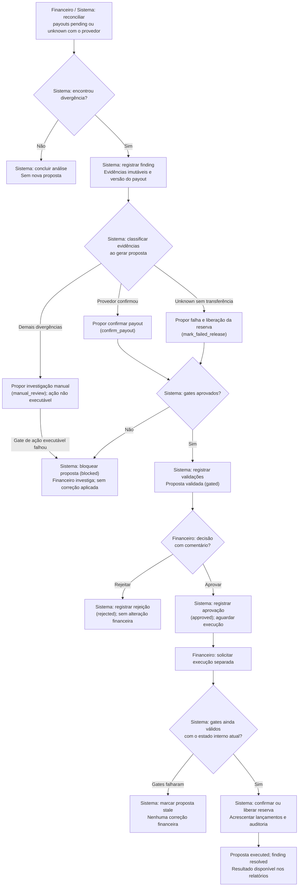
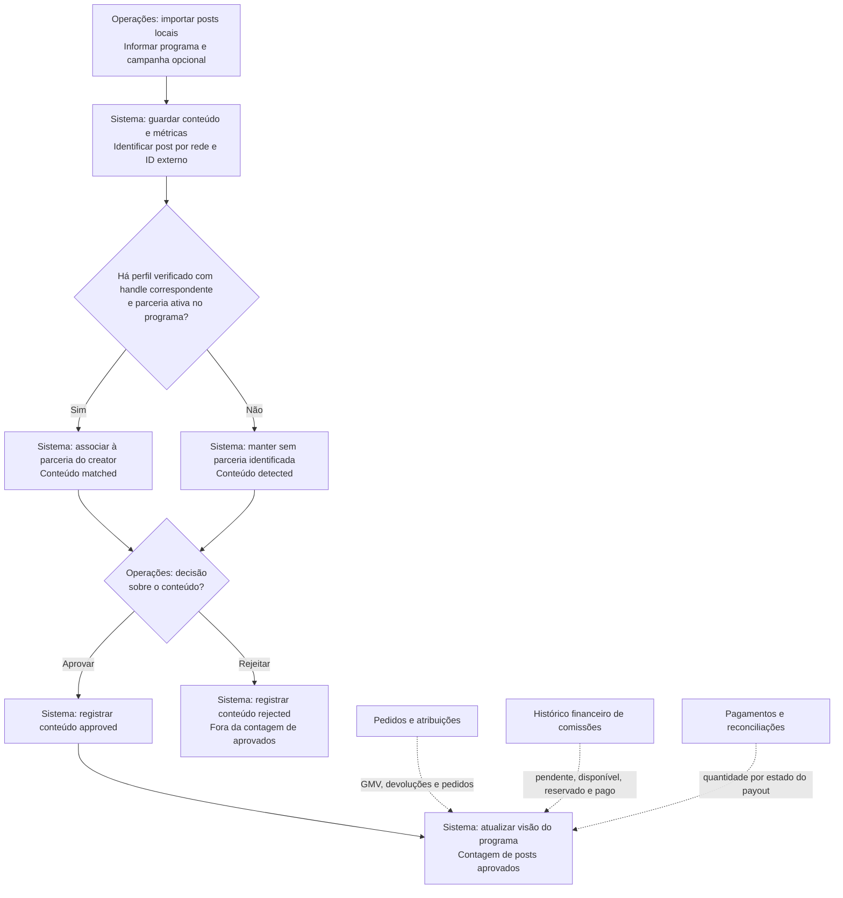

# Regras de domínio para estudo

Este documento serve como roteiro para explicar o projeto em uma entrevista. Para cada regra,
procure responder três perguntas: qual risco de negócio ela evita, onde é aplicada no código e
qual teste a comprova.

## Como ler os diagramas

Os retângulos representam ações ou estados; os losangos representam decisões. As condições
nas setas indicam qual caminho seguir. O texto identifica quem age: Creator, Operações,
Financeiro ou Sistema. Operações corresponde ao papel `ops`, Financeiro a `finance`, e
`owner` também pode realizar as ações desses dois papéis. O plano de comissão é configurado
por Financeiro/owner; termos e campanhas, por Operações/owner.

Os fluxos descrevem o MVP implementado. Os nomes entre parênteses são os estados usados no
sistema. Para a visão resumida, veja o [fluxo de negócio no README](../README.md#fluxo-de-negócio).

- [Programa e parceria](#programa-e-parceria)
- [Atribuição](#atribuição)
- [Comissão](#comissão)
- [Pagamento](#pagamento)
- [Controle agêntico](#controle-agêntico)
- [Conteúdo e mensuração](#conteúdo-e-mensuração)

## Programa e parceria

Ao publicar um novo termo obrigatório, a parceria existente volta a `awaiting_terms`; não é
criada outra candidatura nem apagado seu histórico. Aceitar uma versão obrigatória
ultrapassada é recusado.

- Programa é uma operação contínua; campanha é uma ativação limitada dentro dele.
- Um programa só ativa depois de possuir ao menos um termo e um plano padrão de comissão.
- Aprovar candidatura cria membership em `awaiting_terms`, nunca já ativa.
- Publicar novo termo obrigatório desativa os assets e exige novo aceite.
- Pausar/offboard não apaga histórico, comissão ou saldo.
- Handles normalizados são únicos por rede.

## Atribuição

Cupom e clique precisam pertencer à marca e estar ligados a assets e parcerias ativos.
O MVP avalia o `click_id` recebido no evento: ele não procura automaticamente o último
clique entre todas as visitas. A atribuição ocorre ao aceitar `order.paid`; um pedido apenas
criado ainda não gera comissão.

- O sistema guarda tanto o cupom quanto o clique recebido no campo `signals`.
- Cupom válido vence mesmo quando o clique aponta para outro creator.
- Clique precisa estar dentro da janela e ligado a membership/asset ativos.
- Pedido sem sinal continua registrado e aparece como não atribuído.
- A primeira atribuição persistida é a decisão oficial; correção futura deve virar ajuste
  auditável.

## Comissão

Se houver plano vigente específico da campanha, ele tem prioridade sobre o padrão do
programa. A liquidação pode ser periódica ou solicitada por Financeiro. A comissão da venda
é revertida proporcionalmente ao reembolso; no comportamento atual, o bônus só é revertido
quando o pedido é totalmente devolvido. Cancelar um pedido já pago equivale à devolução total.
Um pedido cancelado antes do pagamento não tem comissão a reverter.

Todos os movimentos são novos lançamentos no ledger (histórico financeiro); os anteriores
permanecem intactos. Uma devolução depois do payout reduz o saldo disponível e pode deixá-lo
negativo, sem desfazer silenciosamente a transferência já confirmada.

- O GMV mensal incluindo a venda atual escolhe a faixa.
- A taxa escolhida vale somente para a venda atual; não recalcula pedidos anteriores.
- Bônus tem unique por creator, regra e período.
- `eligible_at` materializa a janela de devolução.
- Reembolso antes da liquidação afeta `pending`; depois afeta `available`.
- A comissão grava `plan_id` e `plan_version` para preservar o cálculo histórico.

## Pagamento

O rascunho não reserva dinheiro. A aprovação confere todos os payouts na mesma transação;
se faltar saldo, nenhuma reserva desse lote é aplicada. No estado `unknown`, a ausência de
resposta não prova que o pagamento falhou: não se cria outra transferência com uma nova chave.

- O lote `draft` é um snapshot. Aprovar compara o snapshot ao saldo atual sob lock.
- Aprovação move saldo disponível para reservado e cria a outbox.
- `failed` devolve a reserva; `unknown` mantém a reserva.
- O simulador persiste por idempotency key e recusa a mesma chave com payload diferente.
- `timeout_after` é o caso perigoso: a transferência existe apesar da ausência de resposta.

## Controle agêntico

Os gates comparam marca, estado, versão, evidências, reserva e, ao confirmar, valor, moeda,
beneficiário e chave da transferência. Também verificam a ausência de confirmação financeira
duplicada. Sem aprovação registrada, a tentativa de execução é recusada antes de aplicar
qualquer correção; se a proposta já foi executada, o retry devolve o resultado existente.

O gerador atual propõe confirmação, falha com liberação de reserva ou investigação manual.
Divergências de valor, transferência duplicada e saldo do ledger vão para investigação; não
há execução genérica de ajustes automáticos para esses casos. As propostas começam em
`draft`; em `manual_review`, o gate de ação executável falha. O desenho mostra a rejeição
após os gates, mas Financeiro também pode rejeitar uma proposta ainda não executada antes
dessa etapa.

Na execução, a revalidação usa o estado interno atual e as evidências capturadas na
reconciliação. Não há uma nova consulta ao provedor dentro dos gates.

- Detecção registra fatos e versões; não prescreve nem muda estado.
- Geração propõe uma ação estruturada; não executa.
- Gates são código determinístico e seus resultados ficam persistidos.
- Aprovação exige papel financeiro/owner e comentário, mas ainda não executa.
- Executor repete os gates dentro da transação. Versão alterada torna a proposta `stale`.
- A correção financeira adiciona lançamentos; não edita o passado.

## Conteúdo e mensuração

- Matching não é aprovação: mesmo um post `matched` precisa de revisão para contar como
  aprovado. Enquanto não revisado, permanece `detected` ou `matched`.
- Reimportar o mesmo post atualiza o registro pela rede e ID externo; não cria outro post.
  No comportamento atual, a reimportação recalcula o matching e volta o estado para
  `detected` ou `matched`, exigindo nova aprovação para entrar no relatório.
- Operações também pode revisar um post sem creator identificado. O relatório atual conta
  posts `approved` do programa, sem exigir vínculo com uma parceria.
- As métricas importadas ficam no conteúdo. A visão consolidada expõe contagem de posts
  aprovados, pedidos, GMV, devoluções, creators ativos, saldos e estados dos pagamentos.
- Aprovar um post não gera comissão nem libera pagamento. Essas decisões dependem da venda
  atribuída, do plano de comissão e do saldo financeiro.

## Perguntas para se testar

1. Por que a constraint do webhook é composta por marca, provedor e event ID?
2. O que aconteceria se o worker caísse depois de publicar e antes de marcar a outbox?
3. Por que `unknown` não pode liberar a reserva?
4. Por que aprovação e execução são etapas diferentes?
5. Como a versão do payout impede um TOCTOU entre gate e execução?
6. Qual estado é fonte da verdade quando Pub/Sub e Postgres discordam?
7. Em que momento um microsserviço separado seria justificável?
